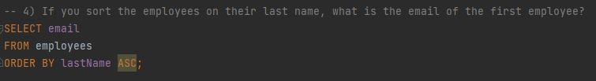
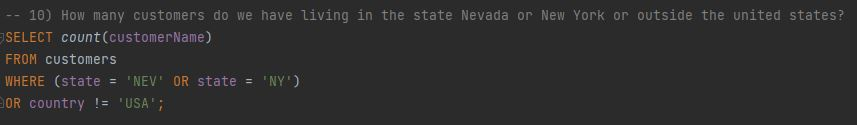

# SQL-Advanced-queries-Exercises

-- 1) How many customers do we have? Making this sentence longer for layout purposes on Github

-- 2) What is the customer number of Mary Young? Making this sentence longer for layout purposes on Github

-- 3) What is the customer number of the person living at Magazinweg 7, Frankfurt 60528?

-- 4) If you sort the employees on their last name, what is the email of the first employee?

-- 5) If you sort the employees on their last name, what is the email of the last employee?

-- 6) What is first the product code of all the products from the line 'Trucks and Buses', sorted first by productscale, then by productname.

-- 7) What is the email of the first employee, sorted on their last name that starts with a 't'?

-- 8) Which customer (give customer number) payed by check on 2004-01-19?

-- 9) How many customers do we have living in the state Nevada or New York?

-- 10) How many customers do we have living in the state Nevada or New York or outside the united states?

-- 11 How many customers do we have with the following conditions (only 1 query needed):  - Living in the state Nevada or New York OR - Living outside the USA and with a credit limit above 1000 dollar?

-- 12) How many customers don't have an assigned sales representative?
