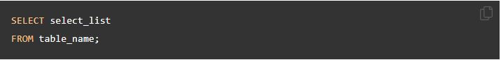

# SQL-Advanced-queries

## Learning objectives
- Able to look up information about sql on the web
- Able to query a complicated database schema and answer data questions

## 🌱 Must-haves

### The syntax: learning SQL
This [basic MySQL tutorial](https://www.mysqltutorial.org/basic-mysql-tutorial.aspx) explains some basic SQL statements. If this is the first time you have used a relational database management system, this tutorial teaches you everything you need to know to work with MySQL such as querying data, updating data, managing databases, and creating tables.

This is a selection of all interesting and common used ways of reading data out MySQL.
With the knowledge you will gain here, you will be able to answer all questions below!

1. Querying data
   	- [SELECT – show you how to use simple SELECT statement to query the data from a single table.](https://www.mysqltutorial.org/mysql-select-statement-query-data.aspx)
		- First Specify one or more columns from wich you want to select data after the SELECT keyword.
	

2. Sorting data
	- [ORDER BY – show you how to sort the result set using ORDER BY clause. The custom sort order with the FIELD function will be also covered.](https://www.mysqltutorial.org/mysql-order-by/)
		- After SELECTING data from the table/columns you can then ORDER BY ascending or descending or for instance by contactLastname.
	

3. Filtering data
	- [X] [WHERE – learn how to use the WHERE clause to filter rows based on specified conditions.](https://www.mysqltutorial.org/mysql-where/)
		- The WHERE clausule allows you to specify a search condition for the rows returned by a query. 
	

	- [X] [SELECT DISTINCT – show you how to use the DISTINCT operator in the SELECT statement to eliminate duplicate rows in a result set.](https://www.mysqltutorial.org/mysql-distinct.aspx)
		- The SELECT DISTINCT clausule removes duplicate rows when querying data from a table.
	

	- [X] [AND – introduce you to the AND operator to combine Boolean expressions to form a complex condition for filtering data.](https://www.mysqltutorial.org/mysql-and/)
		- MySQL doesn’t have a built-in Boolean type. Instead, it uses the number zero as FALSE and non-zero values as TRUE.
	

	- [X] [OR– introduce you to the OR operator and show you how to combine the OR operator with the AND operator to filter data.](https://www.mysqltutorial.org/mysql-or/)
		- The MySQL OR operator is a logical operator that combines two Boolean expressions.
	

	- [X] [IN – show you how to use the IN operator in the WHERE clause to determine if a value matches any value in a list or a subquery.](https://www.mysqltutorial.org/mysql-basics/mysql-in/)
		- The IN operator allows you to determine if a value matches any value in a list of values.
	

	- [X] [BETWEEN – show you how to query data based on a range using BETWEEN operator.](https://www.mysqltutorial.org/mysql-between)
		- The BETWEEN operator is a logical operator that specifies whether a value is in a range or not.
	
	
	- [X] LIKE – provide you with technique to query data based on a specific pattern.
		- The LIKE operator is a logical operator that tests whether a string contains a specified pattern or not.
	

