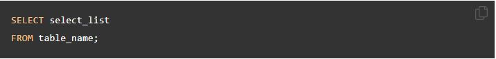
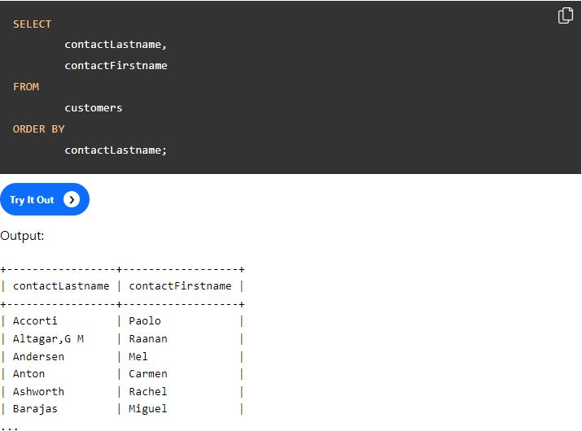
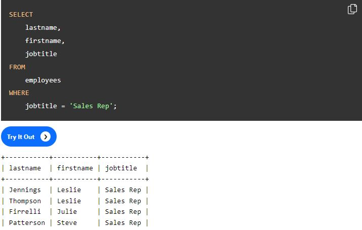

# SQL-Advanced-queries

## Learning objectives
- Able to look up information about sql on the web
- Able to query a complicated database schema and answer data questions

## 🌱 Must-haves

### The syntax: learning SQL
This [basic MySQL tutorial](https://www.mysqltutorial.org/basic-mysql-tutorial.aspx) explains some basic SQL statements. If this is the first time you have used a relational database management system, this tutorial teaches you everything you need to know to work with MySQL such as querying data, updating data, managing databases, and creating tables.

This is a selection of all interesting and common used ways of reading data out MySQL.
With the knowledge you will gain here, you will be able to answer all questions below!

1. Querying data
   	- [SELECT – show you how to use simple SELECT statement to query the data from a single table.](https://www.mysqltutorial.org/mysql-select-statement-query-data.aspx)
		- First Specify one or more columns from wich you want to select data after the SELECT keyword.
	

2. Sorting data
	- [ORDER BY – show you how to sort the result set using ORDER BY clause. The custom sort order with the FIELD function will be also covered.](https://www.mysqltutorial.org/mysql-order-by/)
		- After SELECTING data from the table/columns you can then ORDER BY ascending or descending or for instance by contactLastname.
	

3. Filtering data
	- [WHERE – learn how to use the WHERE clause to filter rows based on specified conditions.](https://www.mysqltutorial.org/mysql-where/)
		- The WHERE clausule allows you to specify a search condition for the rows returned by a query. 
	